# Particle Filters
 In this section, you will learn about particle filters for estimating the state of a system
 
## Content
#### 1. Introduction
#### 2. Using Robot Class
#### 3. Robot World
#### 4. Creating Particles
#### 5. Importance Weight
#### 6. Resampling
#### 7. Implementation of resampling
#### 8. Orientation
#### 9. Error
#### 10.Math behind the particle filter

 
## Introduction

In this section, you will learn about particle filters. In our sequence of algorithms () for estimating the state of a system, this is the third one and in many ways is the best one because:

* It's the easiest to program 
* In most ways is the most flexible. 

The state space for particle filters is usually continuous and we're not confined to unimodal distributions We can actually represent arbitrarily multimodal distributions but the key advantage is they're really easy to program. 
See a particle filter in action. Below is a floor plan of an environment where a robot is located and it has to perform what is called global localization, it has no clue where it is and it has to find out where it is just based on sensor measurements. 

This Robot has range sensors as indicated by the blue stripes, the Robot uses sonar sensors, which means sound, to range the distance of nearer obstacles and it must use these distance sensors to determine a good posterior distribution of where it is, what the robot doesn't know. In fact, it's completely uncertain where it is. 

Now, the particle filter is represented using particles. Each of these red dots (below figure) of which there are several thousand here is a discrete guess where the robot might be. It's structured as a X coordinate, a Y coordinate, and also a heading direction and these 3 values together comprise a single guess, but a single guess is not a filter.
A filter is the set of several thousands of such guesses that together comprise an approximate representation for the posterior of the robot. 

 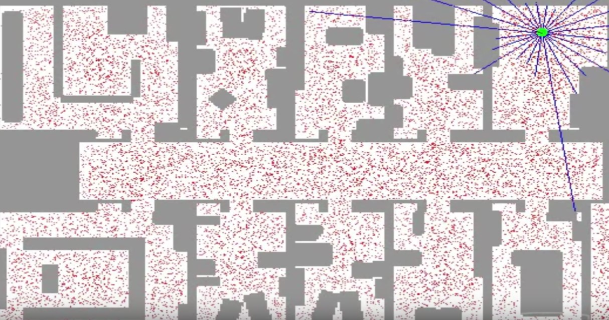 
 
In the beginning of the performing of the particle filter, particles are uniformly spread, 
but the particle filter makes them survive in proportion of how consistent one of these particles is with a sensor measurement. Very quickly the robot has figured out it's in the corridor, but 2 clouds survive because of the symmetry of the corridor (see below figure). 

 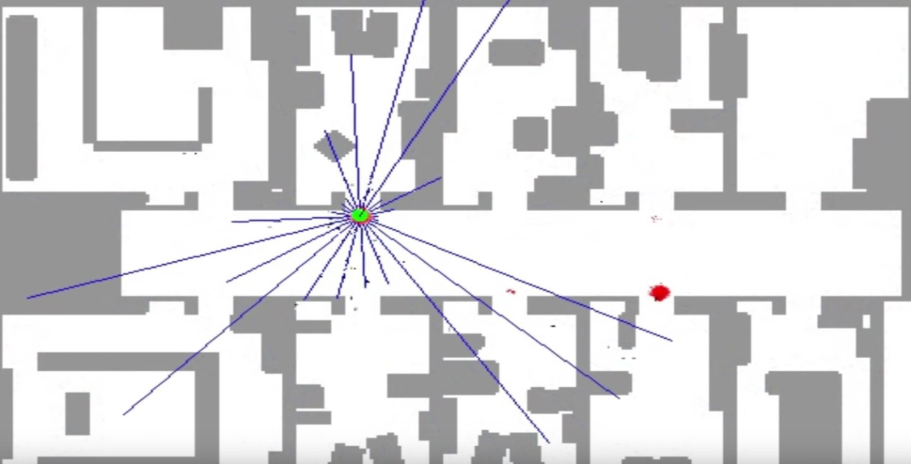 
 

As the robot enters one of the offices, the symmetry is broken and the correct set of particles survive (below figure). 

 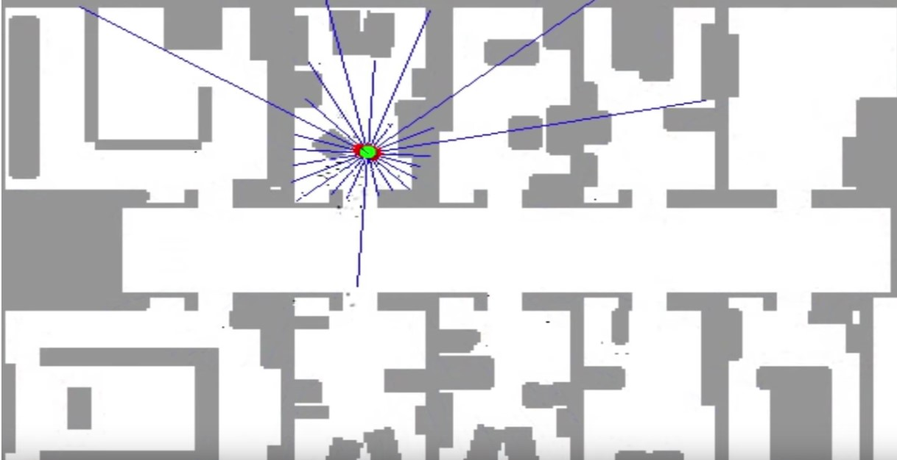 
 

The essence of particle filters is to have the particles guess, where the robot might be moving but also have them survive using effectively survival of the fittest so that particles that are more consistent with the measurements are more likely to survive and as a result places of high probability will collect more particles and therefore be more representative of the robot's posterior belief. Those particles together(those thousands of particles) are now clustered in a single location(see above figure). Those comprise the approximate belief of the robot as it localizes itself. 

## Using Robot Class

A piece of code is written to demonstrate a robot class. The main class is a class called robot. This robot lives in a 2-dimensional world of size 100 meters. It can see 4 different landmarks that are located at the following coordinates: 20, 20; 80,80; 20,80; 80,20.

Noise filters are really important for particle filters. To assimilate noise, the robot class has a function that allows you to set them, but the noise filters are all now set to 0 and you can play with them if you want. 
The robot class has also a function that is important as we implement particle filters called measurement_prob, it accepts a measurement and tells you how plausible the measurement is (the key thing for the survival of the fittest rule in particle filters)

 
Below is how we make such a robot. It's really easy. All you have to do is call a function robot() and assign it to a variable myrobot. Now that we can do things with myrobot. For example, we can set a position. These 3 values are the X coordinate, the Y coordinate, and the heading in radians.
~~~python
myrobot = robot()
myrobot.set(10,10,0.0)
print (myrobot)
~~~ 
[x=10.0 y=10.0 orient=0.0]

We can make the robot move. This robot moves 10 meters forward and doesn't turn. 
So, let's print the resulting position. 

~~~python
myrobot = robot()
myrobot.set(10,10,0.0)
print(myrobot)
myrobot=myrobot.move(0.0,10)
print(myrobot)
~~~ 
[x=10.0 y=10.0 orient=0.0]

[x=20.0 y=10.0 orient=0.0]

let's make the robot turn by pi/2 and move 10 meters. So, now the robot is heading in the direction of pi/2(North), and it moved forward 10 meters in the Y direction, instead of the X direction. 
~~~python
myrobot = robot()
myrobot.set(10,10,0.0)
print(myrobot)
myrobot=myrobot.move(pi/2,10)
print(myrobot)
~~~ 

[x=10.0 y=10.0 orient=0.0]

[x=10.0 y=20.0 orient=1.5707]

The last thing I want to show is how to generate measurements. There is a really easy command called sense() and all it does is give you the distance to the 4 landmarks.

~~~python
myrobot = robot()
myrobot.set(10,10,0.0)
print(myrobot)
myrobot=myrobot.move(pi/2,10)
print(myrobot)
print (myrobot.sense())
~~~ 

[x=10.0 y=10.0 orient=0.0]

[x=10.0 y=20.0 orient=1.5707]

[10.0, 92.19544457292888, 60.8276253029822, 70.0]

## Robot World

Now we know about the class robot, who can turn and then move straight after the turn, and it also can sense the distance to 4 designated landmarks, L1, L2, L3, and L4, and these distances comprise the measurement vector of the robot. 

I told you the robot lives in a world of size 100 x 100 and if this robot falls off one end, it appears on the other. it's a cyclic world. 

 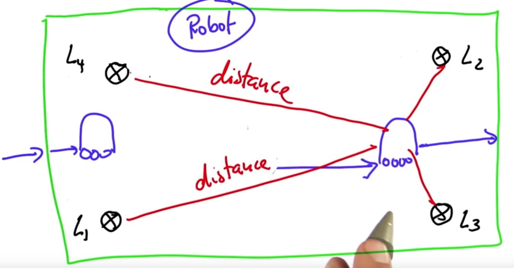 
 

## Creating Particles

The particle filter that we are going to program maintains a set of 1000 random guesses (red dots) as to where the robot might be. Each of the red dots is a vector which contains an X coordinate, in this case 38.2, a Y coordinate 12.4 and a heading direction of 0.1, which is the angle at which the robot points relative to the X axis (see below figure). 

 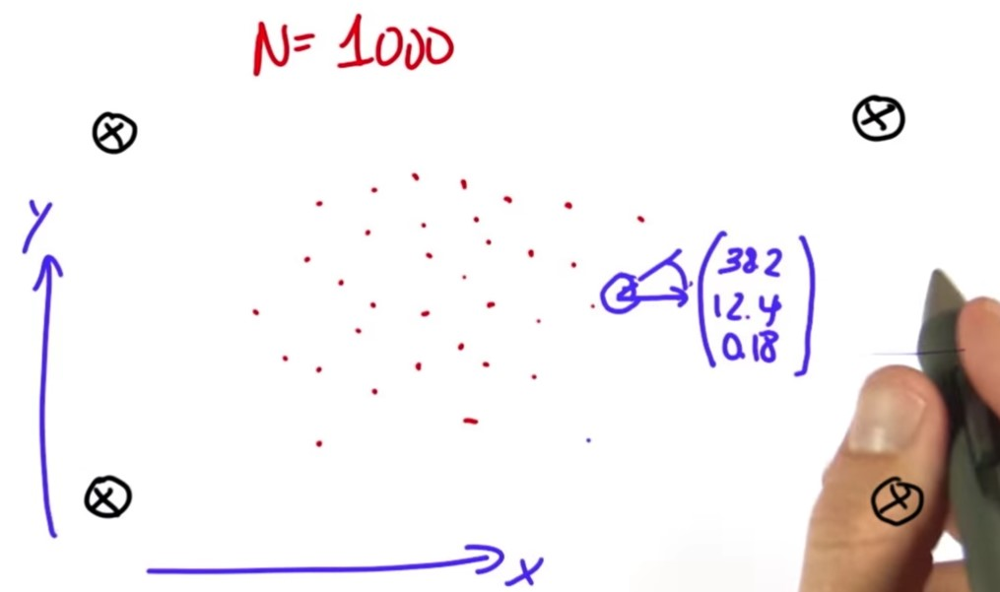 
 

to make a particle set of 1000 particles, every time we call the function robot and assign it to a list called p[],the elements of the p[] are x, y, and orientation which are initialized at random. 

~~~python
N=1000
p=[]
for i in range(N):
    x=robot()
    p.append(x)
print(len(p))
~~~ 
100

I now want to take each of these particles and simulate robot motion. Depending on the heading direction, this might yield a different direction. So, each of these particles shall first turn by 0.1 and then move by 5 meters (below figure).

 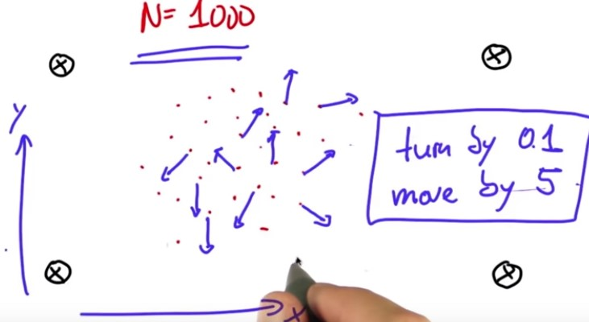 
 

~~~python
N=1000
p=[]
for i in range(N):
    x=robot()
    p.append(x)
print(len(p))
p2=[]
for i in range(N):
    p2.append(p[i].move(.1,5.0))
p=p2

~~~ 
I got about half of particle filters implemented, unfortunately it's the easy half, but the difficult half isn't that much more difficult.

## Importance Weight

To explain how the second half works, suppose an actual robot sits in the middle of the world, 
and it measures these exact distances to the four landmarks Obviously (see below figure), there are some measurement noise that we just model as an added Gaussian with zero mean meaning there would be a certain chance of being too short or too long and that probability is governed by a Gaussian. 

 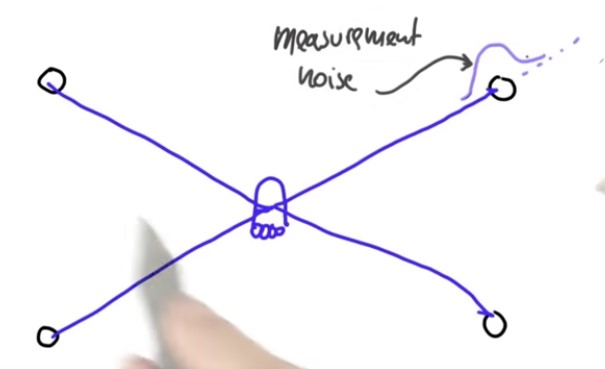 
 

Now let's consider a particle (red in the below figure) that hypothesizes the robot coordinates are close to the actual coordinate (blue in the below figure) and it also hypothesizes a different heading direction. We can then take the measurement vector from the actual coordinate (blue lines) and apply it to the hypothesized particle, obviously this would be a very poor measurement vector for the hypothesized particle (black lines). In particular, the measurement vector we would've expected looks more like green lines.  
That just makes the specific location of the hypothesized particle really unlikely.

 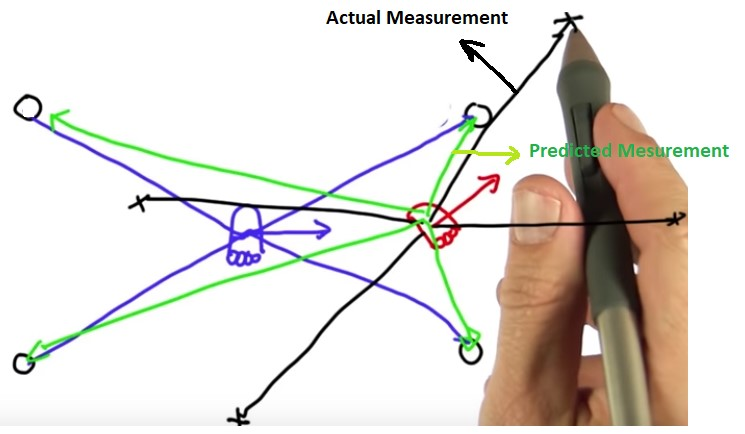 
 

In fact, the closer our particle to the correct position, the more likely will be the set of measurements given that position. Now here comes the big trick in particle filters: the mismatch of the actual measurement and the predicted measurement leads to a so called importance weight that tells us how important that specific particle is.

We have many different particles and a specific measurement. Each of these particles will have a different weight. Some look very plausible, others might look very implausible as indicated by the size of the circles over here(see below figure).
let the particles that are close to the blue point survive somewhat at random but the probability of survival will be proportional to their weights. 

If a particle has a very big weight like the guys near the blue point will survive at a higher proportion than someone with a really small weight, which means after what's called resampling, which is just a technical term for randomly drawing N new particles from the old ones with replacement in proportion to the importance weight. 

 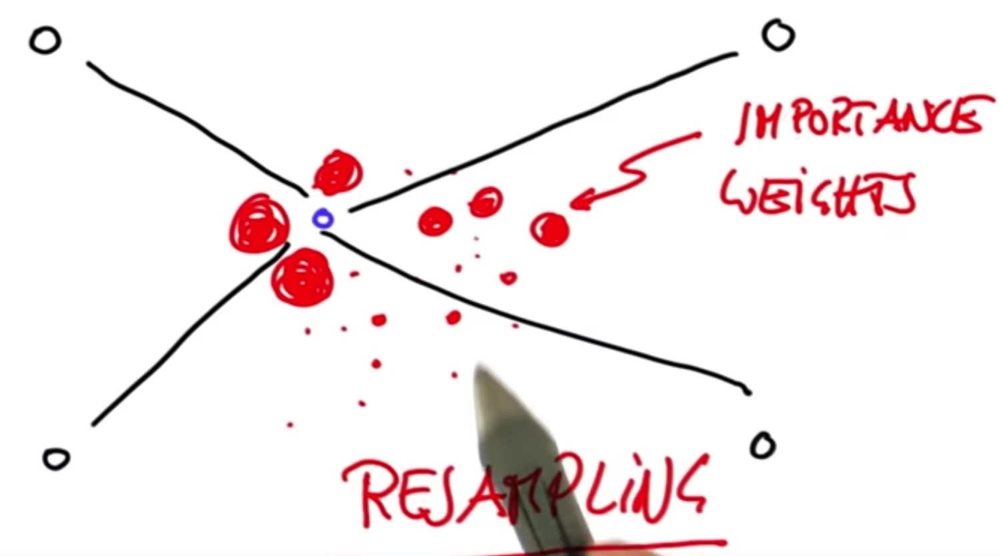 
 

After that resampling phase, the guys near the blue point (actual position) very likely to live on, in fact many, many times whereas the guys far away from the actual position likely have died out. 

We get the fact that the particles cluster around regions of higher posterior probability. 
That is really cool and all we have to do are:

* we have to implement a method for setting importance weights 
* we have to implement a method for resamplingt that grabs particles in proportion to those weights.

What I want you to program now is a way to assign importance weights to each of the particles. I want you to make a list called w of 1000 elements where each element on the list contains a number. The number is proportional to how important that particle is.  

To make things easier It is coded a function in the class robot called the measurement_prob. This function accepts a single parameter, the measurement vector (the Z) and it calculates as an output how likely this measurement is. It uses effectively a Gaussian that measures how far away the predicted measurements would be from the actual measurements. 

We have to actually assume that there is measurement noise. If there is no measurement noise, then the measurement_prob function will end up dividing by 0.

 
To define the noise for the particles where we create the particles for the first time, we initialize the positions with random numbers and assume a certain amount of noise that goes with each particle.

To construct a list of 1000 elements in W so that each number in this vector reflects the output of the function measurement_prob() applied to the measurement Z that we receive from the real robot.
~~~python
N=1000
p=[]
Z = myrobot.sense()

for i in range(N):
    x=robot()
    x.set_noise(0.05,0.05,5.0) #set noise
    p.append(x)
print(len(p))

p2=[]
for i in range(N):
    p2.append(p[i].move(.1,5.0))
p=p2
w=[]
for i in range(N):
    w.append(p[i].measurement_prob(Z))
print(w)

~~~

## Resampling
To emphasize what resampling actually means suppose we are given N particles, each of which has 3 values and they also now have weights (w1, w2, w3, …,wn).  Let's call big W the sum of all these weights, and let's normalize them by dividing each of weight over the normalizer W (alpha 1 would be the weight 1 divided by the normalizer W and so on to alpha N) obviously it goes without saying that the sum of all alphas is now 1, since we normalized them. 

What resampling now does is it puts all these normalized weights into a big bag, and then it draws with replacement N. New set of particles is created by picking each particle with probability alpha. For example, alpha 2 might be large  we're going to pick  P2 or Alpha 3 might also be large so we pick P3 and Alpha 4 might be really small but just by chance you might actually pick it and then we might pick alpha 2, again. You get 2 versions of P2, perhaps even 3 versions of P2, depending on the probabilities.

 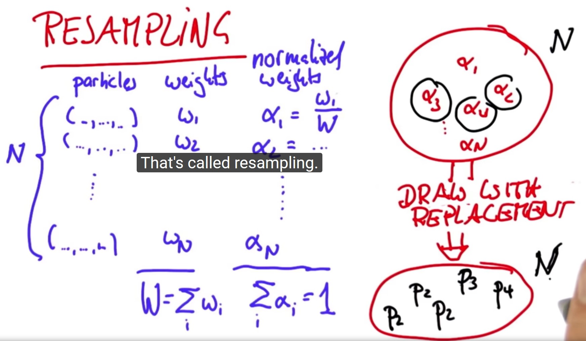 
 

We have N particles over the bag and we do resampling N times, which is why I said with replacement. We can draw multiple copies of the same particle and in the end, those particles that have a high-normalized weight alpha over the bag will occur likely more frequently in the new set. That is called resampling.  To make sure you understand this you can check the section of resampling in the [Jupyter notebook](https://github.com/A2Amir/Particle-Filters/blob/master/Particle%20Filter.ipynb). 

## Implementation of resampling

To modify our algorithm to take the lists of particles and importance weights to sample N times with replacement we construct a new particle set P3 (we will call P, again, when everything is done), which consists of  new particles with a sampling probability proportional to the importance weights.
To code resampling we use an idea, which is more efficient and empirically gives better samples. Let's represent all our particles and importance weight in a big wheel. Each particle occupies a slice that corresponds to its importance weight. Particles with a bigger weight, like W5 (see below figure), occupy more space whereas particles with a smaller weight occupy less space. 

Very initially let's guess a particle index uniformly from the set of all indices, I did note this as a uniform sample at U from the discrete set of choices of index 1 to N and as a caveat in Python, of course, it goes from 0 to N-1. 

Say we pick W6 then, the trick is we are going to construct the variable  called beta which is initialized with 0 and to which I add (when I construct the particles) a uniformly drawn continuous value that sits between 0 and 2 times w max, which is the largest of the importance weights in the important set. 

 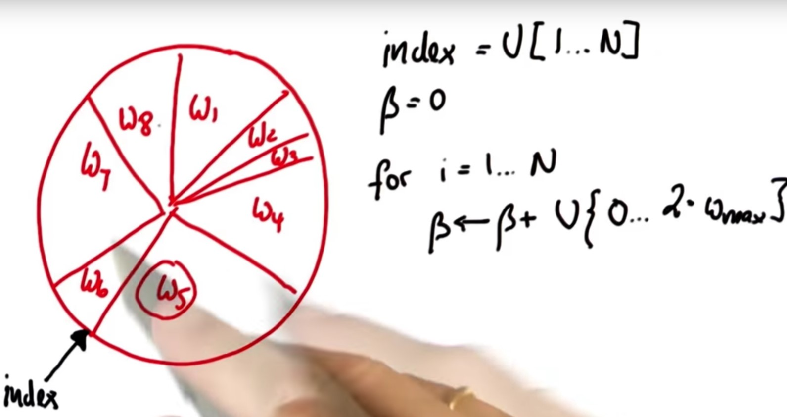 
 

W5 is the largest and we're going to add a random value that might be as large as twice W5. Suppose the value we added brings us to here (green arrow in the below figure), I now then iterate the following loop: 

if the importance weight of the present particle (w6) doesn't suffice to reach all the way to beta( if W index isn't as big as beta) then I subtract from beta the importance weight of the present particle and I increment index by 1. 

 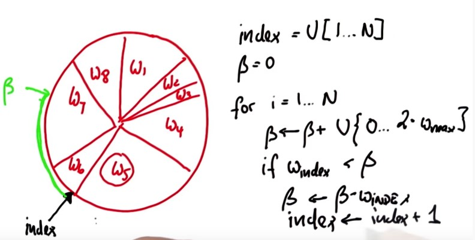 
 

So, what have I done? I have incremented index by one, which moves to the W7 and I removed the corresponding part of beta, which belongs to the w6, and the rest is still the same as before (see below figure). 

 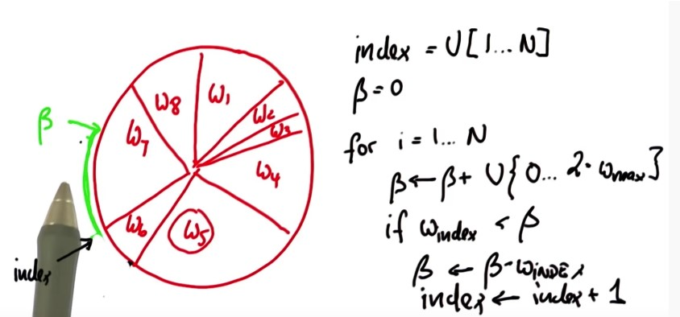 
 

We now get to the point where beta becomes smaller than W index, which is in the next situation. Now index=7, which is the index of the particle I pick in my resampling process (below figure). 

 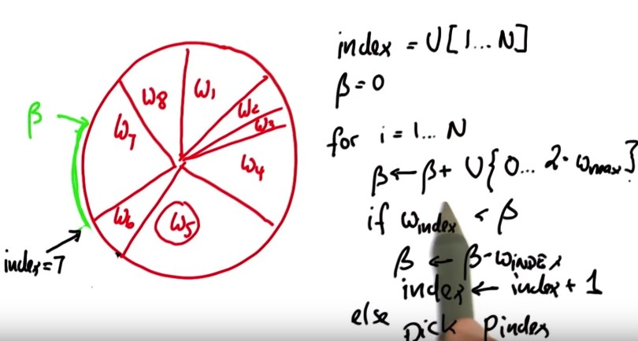 
 

Now I iterate and add another uniform value to beta Say I add this one (blue arrows in the below figure). The same iteration now will make index flow up by reducing beta by all the slice belonging the w8 and incrementing index to w1 and particle one is picked.

 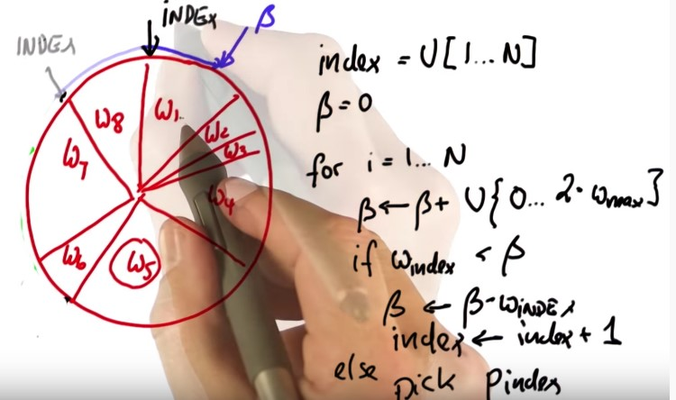 
 

It can easily happen that the uniform value is so small that the same particle is picked twice, and it's easy to see that each particle is now picked in proportion to the total circumference.
This is essentially the implementation for the resampling step, which is presented below:
~~~python

p3=[]
index=int(random.random()*N)
beta=0.0
mw=max(w)
for i in range(N):
    beta=beta+(random.random()*2.0*mw)
    while w[index]<beta:
        beta=beta-index
        index=(index+1)%N
    p3.append(p[index])
p=p3
~~~

## Orientation

We always get a random set of orientations, eventually they matter? Will orientation or heading never play a role?
Of course they will eventually matter. Again, assume our 4 landmarks and consider our robot facing to the right. We get a certain set of distances that is invariant to the orientation but now this robot moves (from point A to point B) and we get a new set of distances and now orientation matters. 

 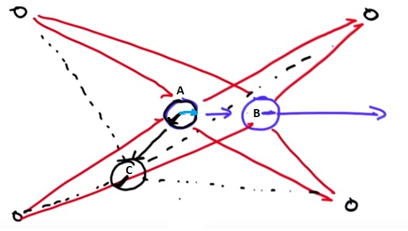 
 

If we assume a different initial orientation, like the black line and that robot moves (from A to C) its measurements will be very, very different. So orientation does matter in the second step of particle filtering because the prediction is so different for different orientations. Let's go and program this. 

To take the particle filter and program it to run twice  we're going to put a "for" loop, 
for t in range(T) and then you have to indent all the stuff below. I indent all the way to the final statement, but I only want to print the final distribution.
~~~python
myrobot = robot()
myrobot = myrobot.move(0.1, 5.0)
Z = myrobot.sense()
N = 1000
T = 10 #Leave this as 10 for grading purposes.

p = []
for i in range(N):
    r = robot()
    r.set_noise(0.05, 0.05, 5.0)
    p.append(r)

for t in range(T):
    myrobot = myrobot.move(0.1, 5.0)
    Z = myrobot.sense()

    p2 = []
    for i in range(N):
        p2.append(p[i].move(0.1, 5.0))
    p = p2

    w = []
    for i in range(N):
        w.append(p[i].measurement_prob(Z))

    p3 = []
    index = int(random.random() * N)
    beta = 0.0
    mw = max(w)
    for i in range(N):
        beta += random.random() * 2.0 * mw
        while beta > w[index]:
            beta -= w[index]
            index = (index + 1) % N
        p3.append(p[index])
    p = p3
print(p)
~~~
I set  the variable T to the 10 steps, I actually get orientations that all look alike.

## Error

It is programmed a "eval" function which takes in as a robot position and a particle set. It computes the average error of each particle, relative to the robot position in "x" and "y" not in the orientation and the way does it, it basically compares the "x" of the particle with the "x" of the robot, computes the Euclidian distance of the differences, and averages all of those.  it sums them all up and it averages them, through the number of particles. 

By adding at the above code only  one line ‘’print(eval(myrobot,p))’ we can produce a sequence of performance evaluations for each step.

## Math behind the particle filter

We had measurement updates and motion updates. In the measurement update, we computed posterior over x, given the measurement and it was proportional to - after normalization -of probability of the measurement given x multiplied by p(x).

 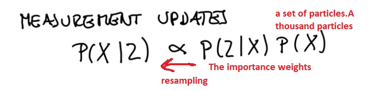 
 

In the motion update, if you compute a posterior of the distribution one time step later 
and that is the convolution of the transition probability times the prior. 

 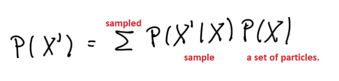 
 

